<div align="center">

<p>
  <a href="https://github.com/Sportarr/Sportarr/blob/main/COPYRIGHT.md"></a>
  <a href="https://discord.gg/YjHVWGWjjG"></a>
</p>


<h3>Sports PVR for Usenet and Torrents</h3>

<p>Like Sonarr &amp; Radarr, but for sports events. Monitors sports leagues, searches your indexers<br>for releases, and handles file renaming, organization, and media server integration.</p>

<p>
  <a href="https://sportarr.net"></a>
  <a href="https://hub.docker.com/r/sportarr/sportarr"></a>
  
  <a href="https://github.com/Sportarr/Sportarr/releases/latest"></a>
  <a href="https://github.com/Sportarr/Sportarr/stargazers"></a>
</p>

</div>

### Downloads

Most people should run Sportarr with **Docker** (above). To run it natively instead, grab your
platform from the [latest release](https://github.com/Sportarr/Sportarr/releases/latest):

| Platform | Options |
|---|---|
|  | **Installer** (`Sportarr-Setup.exe`) installs it for you, or **Portable** (`win-x64.zip`) runs from a folder with no install. |
|  | **Apple Silicon** (`osx-arm64`) for M1/M2/M3/M4 Macs, or **Intel** (`osx-x64`) for older Macs. |
|  | **x64** (`linux-x64`) for most servers, or **ARM64** (`linux-arm64`) for Raspberry Pi and ARM boxes. |

### Support the Project

<p>
  <a href="https://opencollective.com/sportarr"></a>
  <a href="https://ko-fi.com/sportarr"></a>
  <a href="https://sportarr.net/donate/btc"></a>
</p>

---

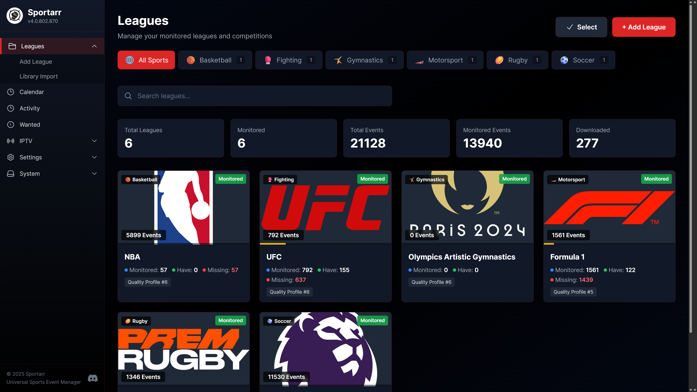

## What It Does

- Tracks events across all major sports (fighting sports, football, soccer, basketball, racing, etc.)
- Searches Usenet and torrent indexers automatically
- Manages quality upgrades when better releases become available
- Organizes files with customizable naming schemes
- Supports multi-part events (prelims, main cards) for fighting sports
- Integrates with Plex, Jellyfin, Emby for library updates
- Fetches subtitles through Bazarr
- Notifies you on grabs, imports, and health issues via Discord, ntfy, Apprise, webhooks, or custom scripts

## Installation

### Docker (Recommended)

```yaml
version: "3.8"
services:
  sportarr:
    image: sportarr/sportarr:latest
    container_name: sportarr
    environment:
      - PUID=99
      - PGID=100
      - UMASK=022
      - TZ=America/New_York  # Optional: Set your timezone
    volumes:
      - /path/to/sportarr/config:/config
      - /path/to/sports:/data
    ports:
      - 1867:1867
    restart: unless-stopped
```

The `/config` volume stores your database and settings. The `/data` volume is your media library root folder.

After starting the container, access the web UI at `http://your-server-ip:1867`.

### Docker Run

```bash
docker run -d \
  --name=sportarr \
  -e PUID=99 \
  -e PGID=100 \
  -e UMASK=022 \
  -e TZ=America/New_York \
  -p 1867:1867 \
  -v /path/to/sportarr/config:/config \
  -v /path/to/sports:/data \
  --restart unless-stopped \
  sportarr/sportarr:latest
```

### Unraid

Sportarr will be available in the Unraid Community Applications after official launch. Search for "sportarr" and install from there. The app is currently in alpha testing and remaining more hidden for limited visibility during this phase.

### Windows / Linux / macOS

Download the latest release from the [releases page](https://github.com/Sportarr/Sportarr/releases). Extract the archive for your platform and run the executable.

By default, configuration is stored in a `data` subdirectory where you run Sportarr from. You can specify a custom location using the `-data` argument:

```bash
# Windows
Sportarr.exe -data C:\ProgramData\Sportarr

# Linux/macOS
./Sportarr -data /var/lib/sportarr
```

Or set the `Sportarr__DataPath` environment variable:

```bash
# Linux/macOS
export Sportarr__DataPath=/var/lib/sportarr
./Sportarr

# Windows PowerShell
$env:Sportarr__DataPath = "C:\ProgramData\Sportarr"
.\Sportarr.exe
```

**Priority order:** Command-line `-data` argument > Environment variable > Default `./data`

## Database

Sportarr uses SQLite by default - no configuration needed. If you already run a
PostgreSQL cluster elsewhere in your setup, Sportarr can use it instead.

**PostgreSQL support is for fresh installs only.** There is no SQLite → PostgreSQL
migration path. Pick your provider before your first run.

`docker-compose.yml` has the PostgreSQL environment variables included as commented-out
lines you can uncomment to switch, and `docker-compose.example.yml` has a full working
example using Docker secrets for the password instead of plaintext.

To use Postgres, set:

| Variable | Purpose |
|---|---|
| `Sportarr__Database__Provider` | `postgres` (omit or `sqlite` for the default) |
| `Sportarr__Database__Host` | Postgres server hostname |
| `Sportarr__Database__Port` | Postgres port (default `5432`) |
| `Sportarr__Database__Name` | Database name |
| `Sportarr__Database__Username` | Database user |
| `Sportarr__Database__Password` | Database password |
| `Sportarr__Database__ConnectionString` | Full connection string, overrides the individual fields above if set |

```yaml
environment:
  - Sportarr__Database__Provider=postgres
  - Sportarr__Database__Host=postgres
  - Sportarr__Database__Port=5432
  - Sportarr__Database__Name=sportarr
  - Sportarr__Database__Username=sportarr
  - Sportarr__Database__Password=change-me
```

Any `Sportarr__*` environment variable can instead be supplied from a file (Docker
secrets) by prefixing it with `FILE__` and pointing the value at the file's path:

```yaml
environment:
  - FILE__Sportarr__Database__Password=/run/secrets/sportarr_db_password
secrets:
  sportarr_db_password:
    file: ./secrets/sportarr_db_password.txt
```

Backup and restore work the same way on both providers (`pg_dump`/`pg_restore` for
Postgres), but a backup can only be restored onto an install running the same provider
it was created on.

## Initial Setup

1. **Root Folder** - Go to Settings > Media Management and add a root folder. This is where Sportarr will store your sports library.

   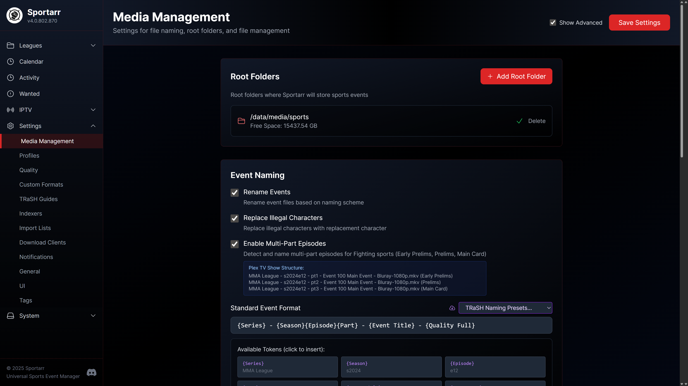

2. **Download Client** - Settings > Download Clients. Add your download client (qBittorrent, Transmission, Deluge, rTorrent, uTorrent, SABnzbd, NZBGet, NZBdav, Decypharr, or a torrent/usenet blackhole folder). If using Docker, make sure both containers can access the same download path.

   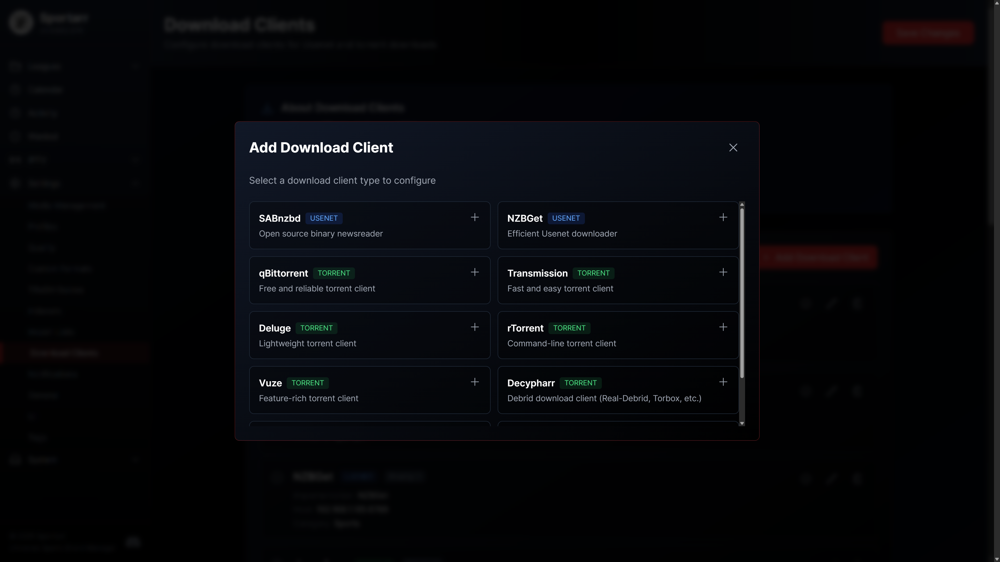

3. **Indexers** - Settings > Indexers. Add your Usenet indexers or torrent trackers. Sportarr supports Newznab and Torznab APIs, so Prowlarr integration works out of the box.

   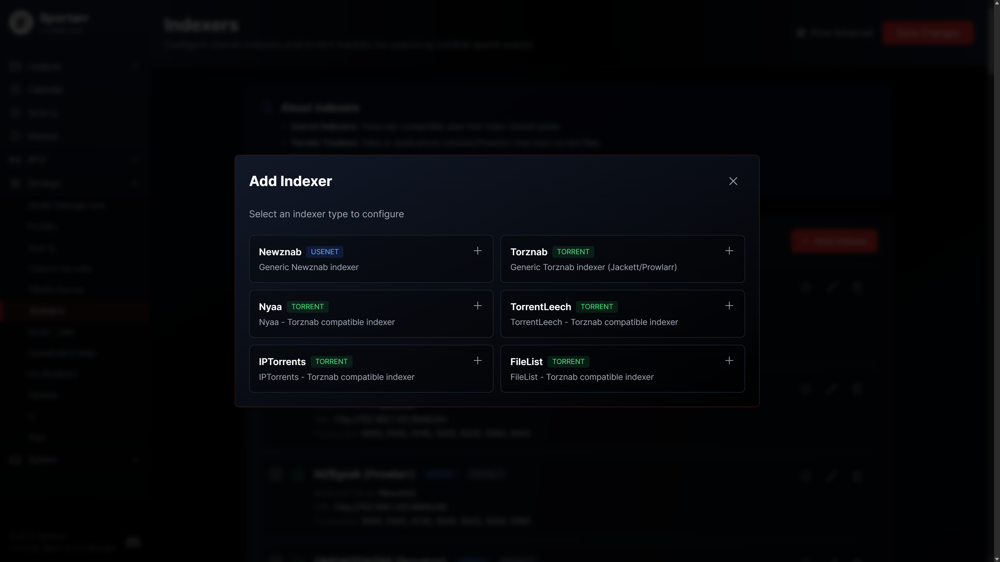

4. **Add Content** - Use the search to find leagues or events. Add them to your library and Sportarr will start monitoring.

   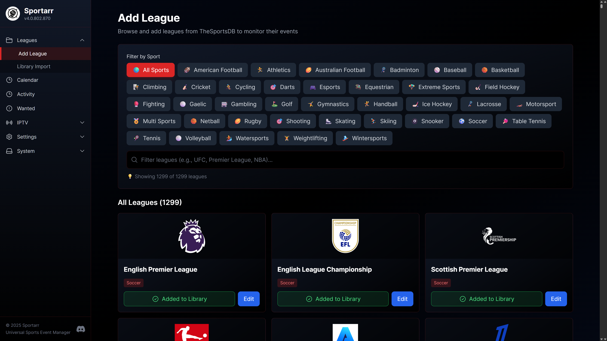

   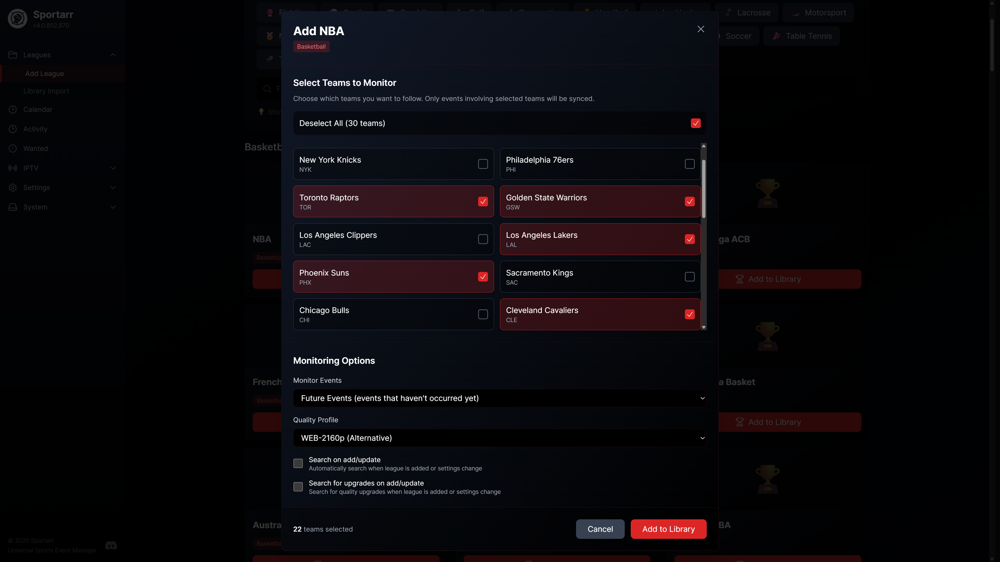

   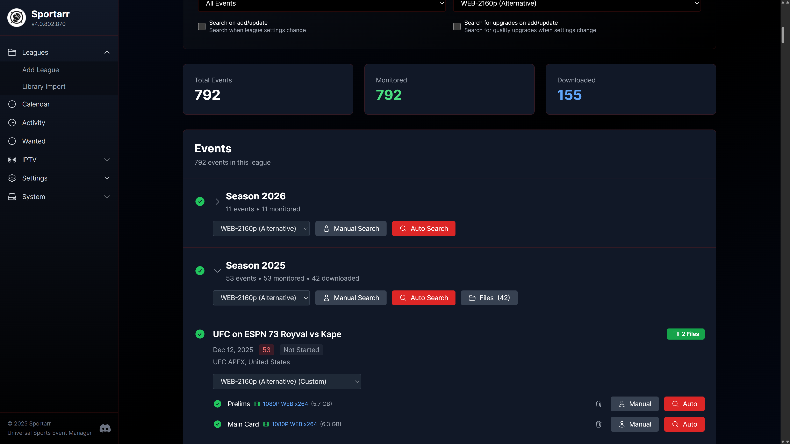

## Supported Download Clients

**Usenet:** SABnzbd, NZBGet, NZBdav

**Torrents:** qBittorrent, Transmission, Deluge, rTorrent, uTorrent

**Blackhole:** Torrent Blackhole, Usenet Blackhole - Sportarr drops the grabbed .torrent/.nzb into a folder for any external downloader and imports the finished download from a watch folder, so you can keep your downloader independent of Sportarr.

**Debrid/Proxy:** Decypharr (torrents and usenet)

## Prowlarr Integration

If you use Prowlarr, you can sync your indexers automatically:

1. In Prowlarr, go to Settings > Apps
2. Add **Sonarr** as an application (Sportarr isn't in Prowlarr yet, but the Sonarr option works)
3. Use `http://localhost:1867` as the URL (or your actual IP/hostname)
4. Get your API key from Sportarr's Settings > General
5. Select **TV (5000)** categories for sync - this includes TV/HD (5040), TV/UHD (5045), and TV/Sport (5060)

Indexers will sync automatically and stay updated.

## Bazarr (Subtitles)

Bazarr can manage subtitles for your sports library. Add Sportarr in Bazarr exactly like you'd add Sonarr:

1. In Bazarr, go to Settings > Sonarr and enable it
2. Set the Address and Port to your Sportarr host (e.g. your server IP and `1867`)
3. Paste your Sportarr API key (Settings > General), then test and save

Bazarr reads your leagues and events and searches for subtitles automatically.

## Notifications

Sportarr can notify you on grabs, imports, upgrades, and health issues. Configure providers in the Notifications settings:

- **Discord** and generic **webhooks** (with optional username/password auth and custom headers)
- **ntfy** (self-hosted or ntfy.sh)
- **Apprise** (one endpoint, 90+ services)
- **Custom scripts** (run any executable on events)

## File Naming

Sportarr uses a TV show-style naming convention that works well with Plex:

```
/data/Sports League/Season 2024/Sports League - s2024e12 - Event Title - 1080p.mkv
```

For fighting sports with multi-part episodes enabled:
```
Sports League - s2024e12 - pt1 - Event Title.mkv  (Early Prelims)
Sports League - s2024e12 - pt2 - Event Title.mkv  (Prelims)
Sports League - s2024e12 - pt3 - Event Title.mkv  (Main Card)
```

You can customize the naming format in Settings > Media Management.

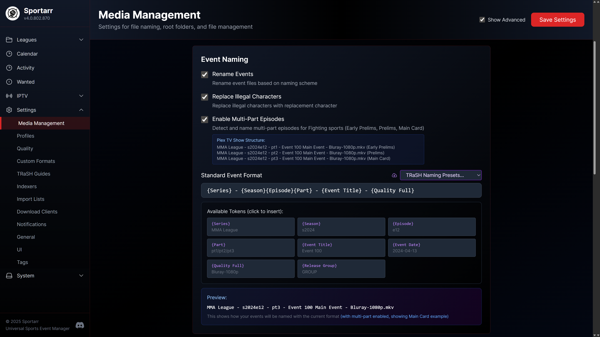

## Media Server Agents

Sportarr provides metadata agents for Plex, Jellyfin, and Emby that fetch posters, banners, descriptions, and episode organization from sportarr.net.

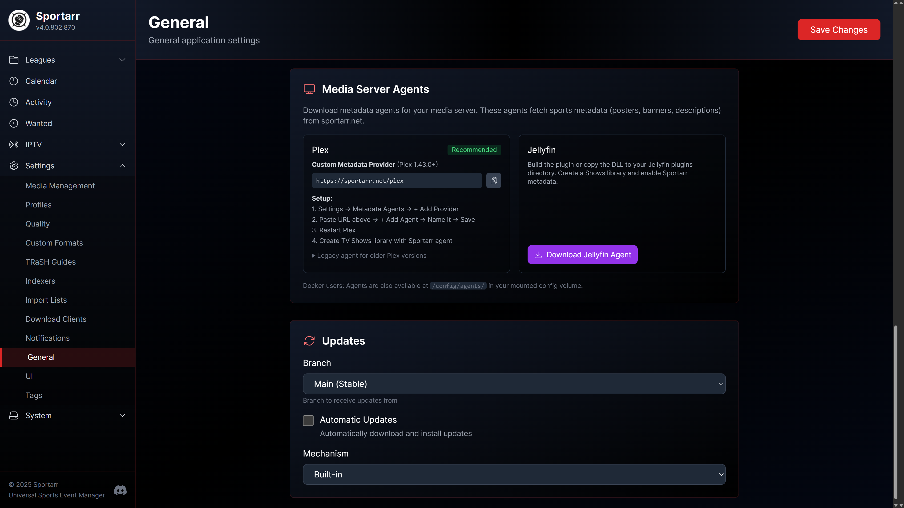

### Plex

Sportarr supports two methods for Plex integration:

#### Custom Metadata Provider (Recommended)

For **Plex 1.43.0+**, use the new Custom Metadata Provider system. No plugin installation required!

1. Open **Plex Web** and go to **Settings → Metadata Agents**
2. Click **+ Add Provider**
3. Enter the URL: `https://sportarr.net/plex`
4. Click **+ Add Agent** and give it a name (e.g., "Sportarr")
5. **Restart Plex Media Server**
6. Create a **TV Shows** library, select your sports folder, and choose the **Sportarr** agent

#### Legacy Bundle Agent

For older Plex versions, download the legacy bundle from Sportarr UI (Settings > General > Media Server Agents) and copy to your Plex Plug-ins directory. Note: Plex has announced legacy agents will be deprecated in 2026.

See [agents/plex/README.md](agents/plex/README.md) for detailed instructions and troubleshooting.

### Jellyfin

1. Build the plugin (requires .NET 9 SDK) or download from releases:
   ```bash
   cd agents/jellyfin/Sportarr
   dotnet build -c Release
   ```

2. Copy the DLL and `meta.json` to your Jellyfin plugins directory. The folder name must include the version (e.g. `Sportarr_1.0.0`):
   - Docker: `/config/data/plugins/Sportarr_<version>/`
   - Windows: `%APPDATA%\Jellyfin\Server\plugins\Sportarr_<version>\`
   - Linux: `~/.local/share/jellyfin/plugins/Sportarr_<version>/`

3. Restart Jellyfin

4. Create a library: select **Shows**, add your sports folder, enable **Sportarr** under Metadata Downloaders

See [agents/jellyfin/README.md](agents/jellyfin/README.md) for detailed instructions.

### Emby

Emby works with the same metadata API as Jellyfin and Plex. Configure it using Open Media data sources:

1. In Emby, go to **Settings → Server → Metadata**

2. Under **Open Media**, add a new provider:
   - **Name**: Sportarr
   - **URL**: `https://sportarr.net`

3. Create a library for your sports content:
   - Select **TV Shows** as the content type
   - Add your sports media folder
   - Under **Metadata Downloaders**, enable **Open Media** and move Sportarr to the top

4. Refresh your library metadata to pull in sports event information

## IPTV DVR Recording (Alpha)

> ⚠️ **ALPHA FEATURE WARNING**: The IPTV DVR functionality is in very early alpha stage. Expect bugs, missing features, and poor functionality while this feature is being developed. Use at your own risk and please report any issues you encounter.

Sportarr includes experimental support for recording live sports events directly from IPTV streams using FFmpeg.

### Features (Work in Progress)

- **IPTV Source Management** - Add M3U playlists or Xtream Codes providers
- **Channel-to-League Mapping** - Map IPTV channels to leagues for automatic recording
- **Automatic DVR Scheduling** - When you monitor an event, Sportarr can automatically schedule a DVR recording if the league has a mapped channel
- **FFmpeg Recording** - Records IPTV streams in transport stream format
- **Auto-Import** - Completed recordings are automatically imported into your event library
- **TV Guide** - EPG-style grid showing channels and their programming with DVR recordings highlighted
- **Filtered M3U/EPG Export** - Serve filtered playlists and EPG data to external IPTV apps

### Requirements

- FFmpeg must be installed and accessible in your system PATH
- A working IPTV source (M3U playlist or Xtream Codes credentials)

### Known Limitations

- Recording quality depends entirely on your IPTV source
- Stream reconnection may not work reliably with all providers
- Limited error handling for stream failures
- No hardware acceleration support yet
- File size estimation is approximate

### Setup

1. Go to Settings > IPTV Sources and add your M3U playlist URL or Xtream Codes provider

   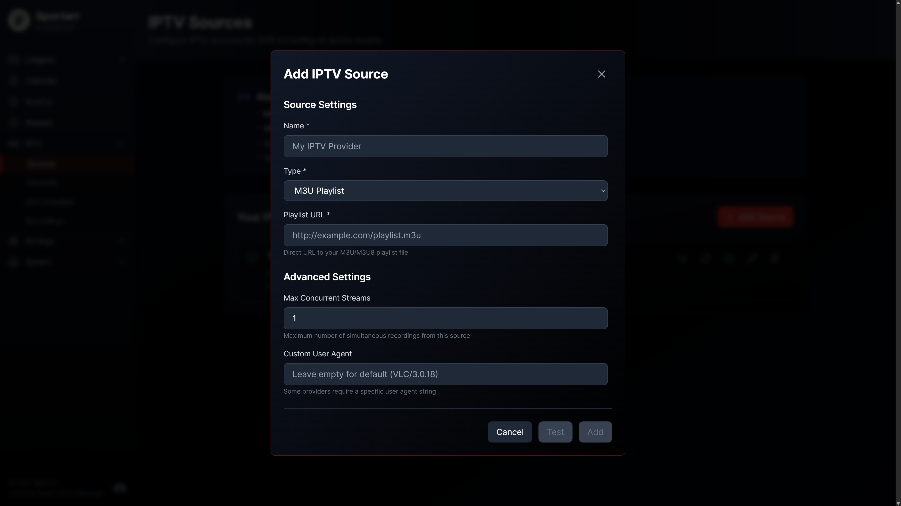

2. Go to Settings > IPTV Channels to view imported channels and map them to leagues

   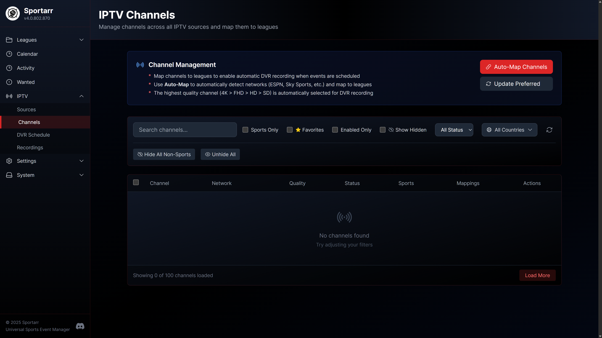

3. Go to Settings > DVR Recordings to configure recording settings and view scheduled/completed recordings

   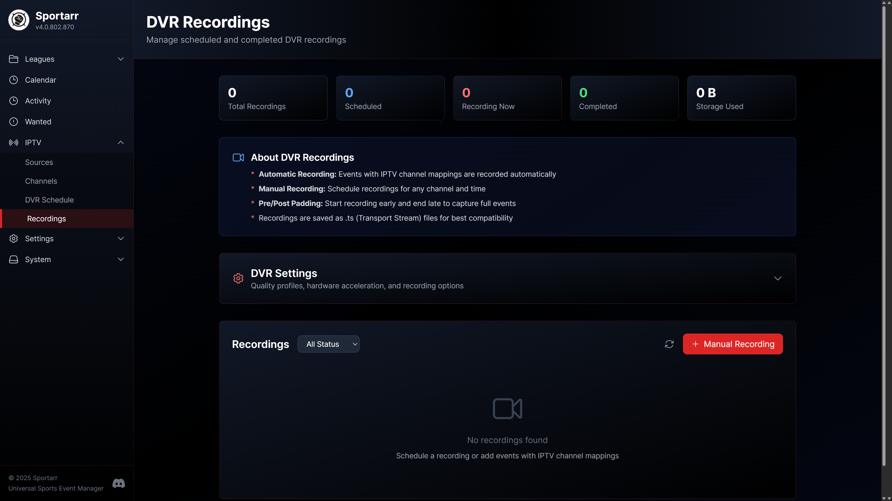

4. When you monitor an event, if its league has a mapped channel, a DVR recording will be automatically scheduled

### TV Guide

The TV Guide provides an EPG-style grid view of your IPTV channels and their programming:

- **EPG Sources** - Add XMLTV EPG sources to populate channel programming
- **Time-based Navigation** - Browse programming in 6-hour increments
- **Filters** - Show only scheduled recordings, sports channels, or enabled channels
- **DVR Integration** - Scheduled recordings are highlighted in the guide
- **Quick Scheduling** - Click any program to view details and schedule a DVR recording

Access the TV Guide from IPTV > TV Guide in the navigation menu.

### Filtered M3U/EPG Export for External Apps

Sportarr can serve filtered M3U playlists and EPG data for use with external IPTV applications like TiviMate, IPTV Smarters, or other players:

- **Filtered M3U** - `http://your-server:1867/api/iptv/filtered.m3u`
- **Filtered EPG** - `http://your-server:1867/api/iptv/filtered.xml`

Optional query parameters:
- `sportsOnly=true` - Only include sports channels
- `favoritesOnly=true` - Only include favorite channels
- `sourceId=X` - Only include channels from a specific source

The filtered exports respect your channel settings - hidden channels are excluded, and only enabled channels are included. Find the subscription URLs in Settings > IPTV Sources under "External App Subscription URLs".

This feature is under active development. Feedback and bug reports are welcome!

## Troubleshooting

**Can't connect to download client in Docker?**
Use the container name (e.g., `qbittorrent`) instead of `localhost`. Make sure both containers are on the same Docker network.

**Files not importing?**
Check that the download path is accessible from within the Sportarr container. The path your download client reports needs to be the same path Sportarr sees.

**Indexer errors?**
Check your API keys and make sure you haven't hit rate limits. Logs are available in System > Logs.

## Support

- [Discord](https://discord.gg/YjHVWGWjjG) - Best place for quick help
- [GitHub Issues](https://github.com/Sportarr/Sportarr/issues) - Bug reports and feature requests
- [GitHub Discussions](https://github.com/Sportarr/Sportarr/discussions) - General questions

## Building from Source

Requires .NET 8 SDK and Node.js 20+.

```bash
git clone https://github.com/Sportarr/Sportarr.git
cd Sportarr

# Build (automatically builds frontend if Node.js is available)
dotnet build src/Sportarr.csproj

# Run
dotnet run --project src/Sportarr.csproj
```

The build process automatically:
1. Builds the React frontend (if npm is available)
2. Copies the frontend to wwwroot
3. Compiles the .NET backend

To skip the automatic frontend build (e.g., if you built it separately):
```bash
dotnet build src/Sportarr.csproj -p:SkipFrontendBuild=true
```

## Project Activity


## Star History

<a href="https://www.star-history.com/?repos=Sportarr%2FSportarr&type=date&legend=top-left">
 <picture>
   <source media="(prefers-color-scheme: dark)" srcset="https://api.star-history.com/chart?repos=Sportarr/Sportarr&type=date&theme=dark&legend=top-left&sealed_token=loM7FRYSXaXqn9lTcTishVtPaTcjxXer6HbzwSQ3Dg7QDKXGmTOsc2xoEc01aDr8vEZFTXyRc76fxgdckzJKpxH84MmDWLWNUY83aEa7xcK5XjOUWMvzqd353S9mqCK4hQ3R7kdhDXZBpI-gBTpD8cQCUEzOq-hFCBEVqXOUz9S9tuaN677TBZ8q0QT2" />
   <source media="(prefers-color-scheme: light)" srcset="https://api.star-history.com/chart?repos=Sportarr/Sportarr&type=date&legend=top-left&sealed_token=loM7FRYSXaXqn9lTcTishVtPaTcjxXer6HbzwSQ3Dg7QDKXGmTOsc2xoEc01aDr8vEZFTXyRc76fxgdckzJKpxH84MmDWLWNUY83aEa7xcK5XjOUWMvzqd353S9mqCK4hQ3R7kdhDXZBpI-gBTpD8cQCUEzOq-hFCBEVqXOUz9S9tuaN677TBZ8q0QT2" />
   
 </picture>
</a>

## Contributors

Sportarr is made better by everyone who has contributed code. Thank you.

<!-- Regenerated automatically by .github/workflows/contributors.yml. The /-
     entries skip the release bot and other automated accounts. The block below
     is pre-filled so the section renders before the first automated run; the
     action replaces it on schedule. -->
<!-- readme: contributors,claude/-,Sportarr/- -start -->
<p>
  <a href="https://github.com/ohathar"></a>
  <a href="https://github.com/BenjaminDecreusefond"></a>
  <a href="https://github.com/mmmmmtasty"></a>
  <a href="https://github.com/gwyden"></a>
  <a href="https://github.com/FacePlant101"></a>
  <a href="https://github.com/gerrewsb"></a>
  <a href="https://github.com/abcattell91"></a>
  <a href="https://github.com/scottrobertson"></a>
  <a href="https://github.com/slflowfoon"></a>
  <a href="https://github.com/skjaere"></a>
  <a href="https://github.com/schlort"></a>
  <a href="https://github.com/Pukabyte"></a>
  <a href="https://github.com/Percentnineteen"></a>
  <a href="https://github.com/nathanjcollins"></a>
  <a href="https://github.com/lyrova-andy"></a>
  <a href="https://github.com/lustered"></a>
  <a href="https://github.com/kristofferR"></a>
  <a href="https://github.com/jpaull-nz"></a>
  <a href="https://github.com/hobbithau5"></a>
  <a href="https://github.com/gilesw"></a>
  <a href="https://github.com/Donai82"></a>
  <a href="https://github.com/afrancke"></a>
</p>
<!-- readme: contributors,claude/-,Sportarr/- -end -->

<sub>See the full <a href="https://github.com/Sportarr/Sportarr/graphs/contributors">contributor graph</a>, plus everyone helping with testing and bug reports on <a href="https://discord.gg/YjHVWGWjjG">Discord</a>.</sub>

## Sponsors

Sportarr is free and self-funded. If it saves you time, a [one-time or monthly contribution](https://opencollective.com/sportarr) keeps it moving, and every supporter shows up here.

<a href="https://opencollective.com/sportarr"></a>

<a href="https://opencollective.com/sportarr"></a>

## License

GNU GPL v3 - see [LICENSE.md](LICENSE.md)

---

Sportarr is based on Sonarr. Thanks to the Sonarr team for the foundation.
