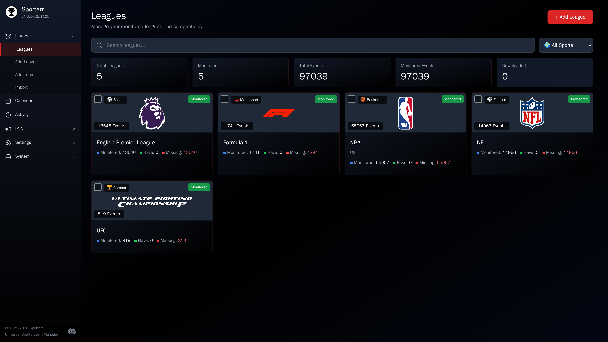

<div align="center">

<p>
  <a href="https://github.com/Sportarr/Sportarr/blob/main/COPYRIGHT.md"></a>
  <a href="https://discord.gg/YjHVWGWjjG"></a>
</p>


<h3>Sports PVR for Usenet and Torrents</h3>

<p>Like Sonarr &amp; Radarr, but for sports events. Monitors sports leagues, searches your indexers<br>for releases, and handles file renaming, organization, and media server integration.</p>

<p>
  <a href="https://sportarr.net"></a>
  <a href="https://hub.docker.com/r/sportarr/sportarr"></a>
  
  <a href="https://github.com/Sportarr/Sportarr/releases/latest"></a>
  <a href="https://github.com/Sportarr/Sportarr/stargazers"></a>
</p>

</div>

### Support the Project

<p>
  <a href="https://opencollective.com/sportarr"></a>
  <a href="https://ko-fi.com/sportarr"></a>
  <a href="https://sportarr.net/donate/btc"></a>
</p>

---



## What It Does

- Tracks events across all major sports (fighting sports, football, soccer, basketball, racing, etc.)
- Searches Usenet and torrent indexers automatically and upgrades quality when better releases appear
- Organizes files with customizable naming schemes, including multi-part events for fighting sports
- Integrates with Plex, Jellyfin, and Emby through dedicated metadata agents
- Records live events from IPTV sources with automatic scheduling (alpha)
- Fetches subtitles through Bazarr and notifies via Discord, ntfy, Apprise, webhooks, or custom scripts

## Quick Start

```yaml
version: "3.8"
services:
  sportarr:
    image: sportarr/sportarr:latest
    container_name: sportarr
    environment:
      - PUID=99
      - PGID=100
      - UMASK=022
      - TZ=America/New_York
    volumes:
      - /path/to/sportarr/config:/config
      - /path/to/sports:/data
    ports:
      - 1867:1867
    restart: unless-stopped
```

Open `http://your-server-ip:1867` and follow the [Initial Setup guide](https://wiki.sportarr.net/getting-started/initial-setup/).

Not on Docker? Native builds for Windows, macOS, and Linux are on the [releases page](https://github.com/Sportarr/Sportarr/releases/latest), and Sportarr is in the TrueNAS SCALE, HexOS, and Unraid app catalogs. Full details in the [installation guide](https://wiki.sportarr.net/getting-started/installation/).

## Documentation

Everything lives on the wiki at **[wiki.sportarr.net](https://wiki.sportarr.net)**:

- [Installation](https://wiki.sportarr.net/getting-started/installation/) and [Initial Setup](https://wiki.sportarr.net/getting-started/initial-setup/)
- [Integrations](https://wiki.sportarr.net/integrations/prowlarr/): Prowlarr, Bazarr, Maintainerr, Homepage, autobrr, and the media server agents
- [IPTV DVR recording](https://wiki.sportarr.net/features/iptv-dvr/)
- [Troubleshooting](https://wiki.sportarr.net/troubleshooting/)
- [Application API](https://wiki.sportarr.net/APPLICATION_API/) for tools integrating with Sportarr, and the [live metadata API explorer](https://wiki.sportarr.net/api-explorer/)
- [Building from source](https://wiki.sportarr.net/development/building/)

## Support

- [Discord](https://discord.gg/YjHVWGWjjG) - best place for quick help
- [GitHub Issues](https://github.com/Sportarr/Sportarr/issues) - bug reports and feature requests
- [GitHub Discussions](https://github.com/Sportarr/Sportarr/discussions) - general questions

## Project Activity


## Star History

<a href="https://www.star-history.com/?repos=Sportarr%2FSportarr&type=date&legend=top-left">
 <picture>
   <source media="(prefers-color-scheme: dark)" srcset="https://api.star-history.com/chart?repos=Sportarr/Sportarr&type=date&theme=dark&legend=top-left&sealed_token=loM7FRYSXaXqn9lTcTishVtPaTcjxXer6HbzwSQ3Dg7QDKXGmTOsc2xoEc01aDr8vEZFTXyRc76fxgdckzJKpxH84MmDWLWNUY83aEa7xcK5XjOUWMvzqd353S9mqCK4hQ3R7kdhDXZBpI-gBTpD8cQCUEzOq-hFCBEVqXOUz9S9tuaN677TBZ8q0QT2" />
   <source media="(prefers-color-scheme: light)" srcset="https://api.star-history.com/chart?repos=Sportarr/Sportarr&type=date&legend=top-left&sealed_token=loM7FRYSXaXqn9lTcTishVtPaTcjxXer6HbzwSQ3Dg7QDKXGmTOsc2xoEc01aDr8vEZFTXyRc76fxgdckzJKpxH84MmDWLWNUY83aEa7xcK5XjOUWMvzqd353S9mqCK4hQ3R7kdhDXZBpI-gBTpD8cQCUEzOq-hFCBEVqXOUz9S9tuaN677TBZ8q0QT2" />
   
 </picture>
</a>

## Contributors

Sportarr is made better by everyone who has contributed code. Thank you.

<!-- Regenerated automatically by .github/workflows/contributors.yml. Lists
     code contributors (merged PRs) only; bots and the release account are
     excluded. Do not hand-edit the block between the markers. -->
<!-- readme: contributors,claude/-,Sportarr/- -start -->
<table>
	<tbody>
		<tr>
            <td align="center">
                <a href="https://github.com/BenjaminDecreusefond">
                    
                    <br />
                    <sub><b>BenjaminDecreusefond</b></sub>
                </a>
            </td>
            <td align="center">
                <a href="https://github.com/ohathar">
                    
                    <br />
                    <sub><b>ohathar</b></sub>
                </a>
            </td>
            <td align="center">
                <a href="https://github.com/mmmmmtasty">
                    
                    <br />
                    <sub><b>mmmmmtasty</b></sub>
                </a>
            </td>
            <td align="center">
                <a href="https://github.com/FacePlant101">
                    
                    <br />
                    <sub><b>FacePlant101</b></sub>
                </a>
            </td>
            <td align="center">
                <a href="https://github.com/gwyden">
                    
                    <br />
                    <sub><b>gwyden</b></sub>
                </a>
            </td>
            <td align="center">
                <a href="https://github.com/abcattell91">
                    
                    <br />
                    <sub><b>abcattell91</b></sub>
                </a>
            </td>
		</tr>
		<tr>
            <td align="center">
                <a href="https://github.com/gerrewsb">
                    
                    <br />
                    <sub><b>gerrewsb</b></sub>
                </a>
            </td>
            <td align="center">
                <a href="https://github.com/scottrobertson">
                    
                    <br />
                    <sub><b>scottrobertson</b></sub>
                </a>
            </td>
            <td align="center">
                <a href="https://github.com/afrancke">
                    
                    <br />
                    <sub><b>afrancke</b></sub>
                </a>
            </td>
            <td align="center">
                <a href="https://github.com/benjamin-decreusefond">
                    
                    <br />
                    <sub><b>benjamin-decreusefond</b></sub>
                </a>
            </td>
            <td align="center">
                <a href="https://github.com/Donai82">
                    
                    <br />
                    <sub><b>Donai82</b></sub>
                </a>
            </td>
            <td align="center">
                <a href="https://github.com/gilesw">
                    
                    <br />
                    <sub><b>gilesw</b></sub>
                </a>
            </td>
		</tr>
		<tr>
            <td align="center">
                <a href="https://github.com/hobbithau5">
                    
                    <br />
                    <sub><b>hobbithau5</b></sub>
                </a>
            </td>
            <td align="center">
                <a href="https://github.com/jpaull-nz">
                    
                    <br />
                    <sub><b>jpaull-nz</b></sub>
                </a>
            </td>
            <td align="center">
                <a href="https://github.com/kristofferR">
                    
                    <br />
                    <sub><b>kristofferR</b></sub>
                </a>
            </td>
            <td align="center">
                <a href="https://github.com/lustered">
                    
                    <br />
                    <sub><b>lustered</b></sub>
                </a>
            </td>
            <td align="center">
                <a href="https://github.com/lyrova-andy">
                    
                    <br />
                    <sub><b>lyrova-andy</b></sub>
                </a>
            </td>
            <td align="center">
                <a href="https://github.com/nathanjcollins">
                    
                    <br />
                    <sub><b>nathanjcollins</b></sub>
                </a>
            </td>
		</tr>
		<tr>
            <td align="center">
                <a href="https://github.com/nickperkins">
                    
                    <br />
                    <sub><b>nickperkins</b></sub>
                </a>
            </td>
            <td align="center">
                <a href="https://github.com/Percentnineteen">
                    
                    <br />
                    <sub><b>Percentnineteen</b></sub>
                </a>
            </td>
            <td align="center">
                <a href="https://github.com/Pukabyte">
                    
                    <br />
                    <sub><b>Pukabyte</b></sub>
                </a>
            </td>
            <td align="center">
                <a href="https://github.com/schlort">
                    
                    <br />
                    <sub><b>schlort</b></sub>
                </a>
            </td>
            <td align="center">
                <a href="https://github.com/skjaere">
                    
                    <br />
                    <sub><b>skjaere</b></sub>
                </a>
            </td>
            <td align="center">
                <a href="https://github.com/slflowfoon">
                    
                    <br />
                    <sub><b>slflowfoon</b></sub>
                </a>
            </td>
		</tr>
	</tbody>
</table>
<!-- readme: contributors,claude/-,Sportarr/- -end -->

<sub>See the full <a href="https://github.com/Sportarr/Sportarr/graphs/contributors">contributor graph</a>, plus everyone helping with testing and bug reports on <a href="https://discord.gg/YjHVWGWjjG">Discord</a>.</sub>

## Sponsors

Sportarr is free and self-funded. If it saves you time, a [one-time or monthly contribution](https://opencollective.com/sportarr) keeps it moving, and every supporter shows up here.

<a href="https://opencollective.com/sportarr"></a>

<a href="https://opencollective.com/sportarr"></a>

## License

GNU GPL v3 - see [LICENSE.md](LICENSE.md)

---

Sportarr is based on Sonarr. Thanks to the Sonarr team for the foundation.
