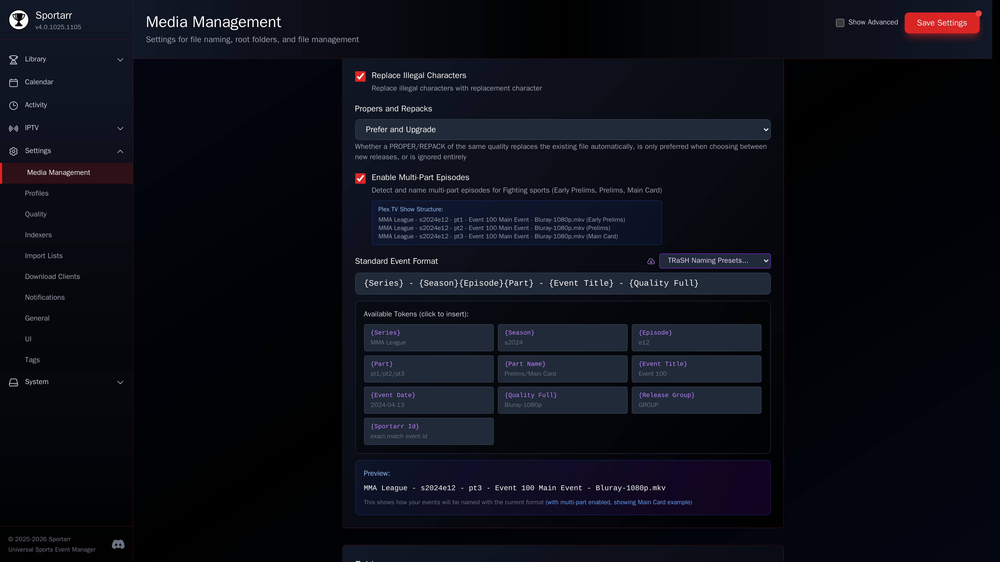

# File Naming

Sportarr uses a TV show-style naming convention that works well with Plex, Jellyfin, Emby, and Kodi:

```
/data/Sports League/Season 2024/Sports League - s2024e12 - Event Title - 1080p.mkv
```

For fighting sports with multi-part episodes enabled:

```
Sports League - s2024e12 - pt1 - Event Title.mkv  (Early Prelims)
Sports League - s2024e12 - pt2 - Event Title.mkv  (Prelims)
Sports League - s2024e12 - pt3 - Event Title.mkv  (Main Card)
```

Customize the naming format in **Settings > Media Management**.



For the release title patterns Sportarr's parser understands per sport, see the [Release Naming reference](../RELEASE_NAMING.md).

## The Sportarr id token

`{Sportarr Id}` writes the event's id into the name as `sportarr-ev-2338110`. Imports and rescans read it back and match the file to its event exactly, so a renamed or moved file never lands on the wrong event. The media server agents read it the same way. Jellyfin and Emby match each file by its Sportarr id first, like a tvdb id, and fall back to the league folder name and the season and episode numbers only for a file that carries no id. Plex matches the show by the id in your file names, the way it reads a tvdb id in a folder name, and then places each file by its season and episode numbers, because that is how Plex places every episode; the Plex legacy bundle matches each file by its id. Kodi gets the id from the `.nfo` Sportarr writes next to the file. Keep the token in your format and a renumbered season can never send a file to another league or, on Jellyfin and Emby, to another game. Sportarr still keeps the numbers current on its own, for files that carry no id and for the episode order your media server shows.

## Changing the format

A format change applies to files imported after it and to files you rename yourself, from a league page or from a season's file list, where the preview covers that season or the files you selected. Existing files are renamed on their own only when their season or episode number changes, so a renumbered season keeps its files identifiable in your media server. The same goes for folders: a change to the folder format, or a league renamed at the source, does not move existing files. Use Rename Files for that.
