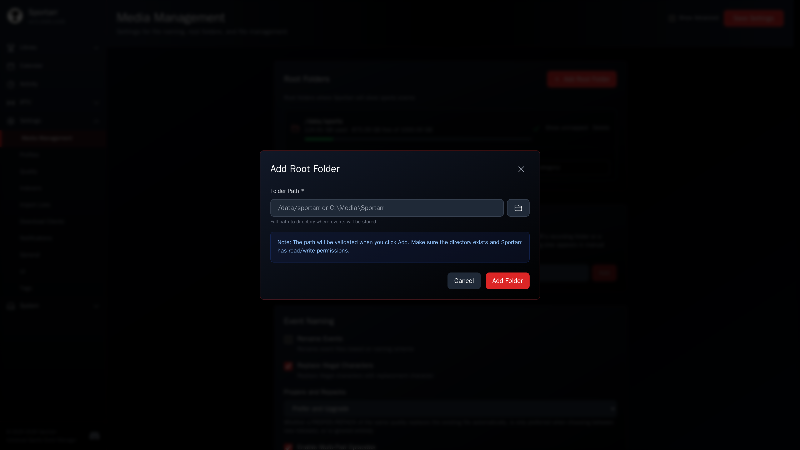
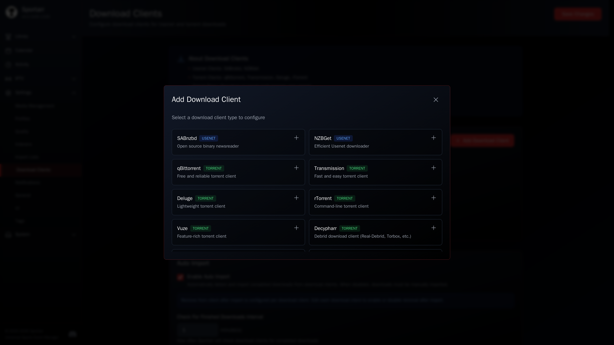
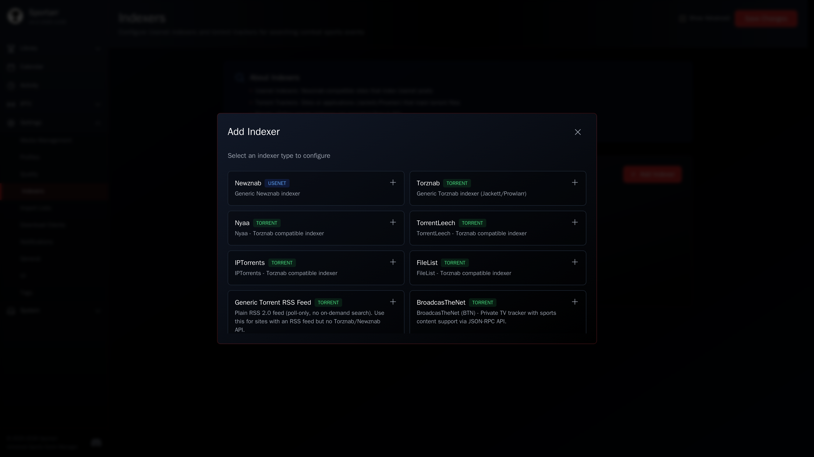
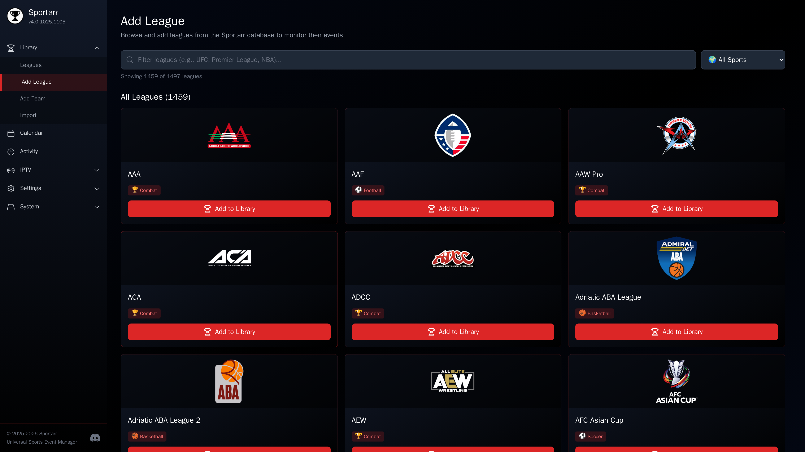
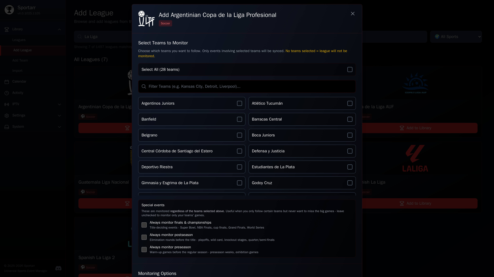
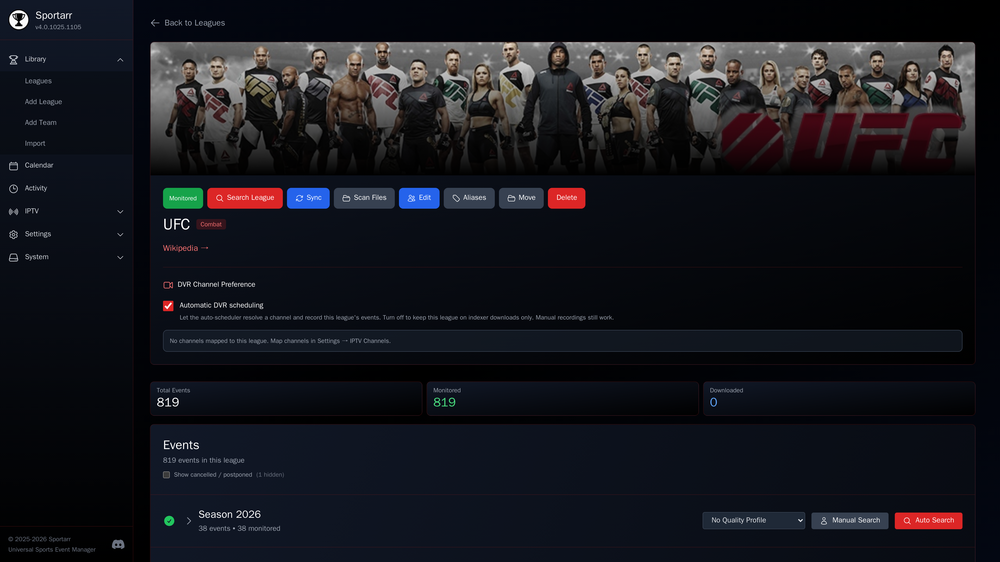

# Initial Setup

Four steps take a fresh install to a working library.

## 1. Root folder

Go to **Settings > Media Management** and add a root folder. This is where Sportarr stores your sports library.

## 2. Download client

**Settings > Download Clients**. Add your download client: qBittorrent, Transmission, Deluge, rTorrent, uTorrent, SABnzbd, NZBGet, NZBdav, Decypharr, or a torrent/usenet blackhole folder.

!!! tip "Docker path alignment"
    If both apps run in Docker, make sure the download path is visible to both containers at the same path. When paths differ between hosts, set up a remote path mapping in Sportarr.

## 3. Indexers

**Settings > Indexers**. Add your Usenet indexers or torrent trackers. Sportarr supports Newznab and Torznab APIs, so [Prowlarr integration](../integrations/prowlarr.md) works out of the box.

## 4. Add content

Use the search to find leagues or events. Add them to your library and Sportarr starts monitoring.

