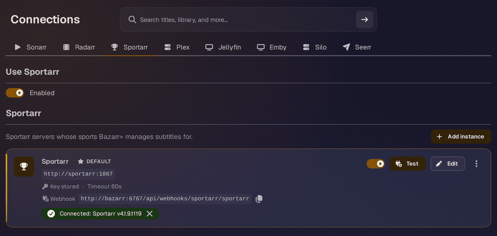
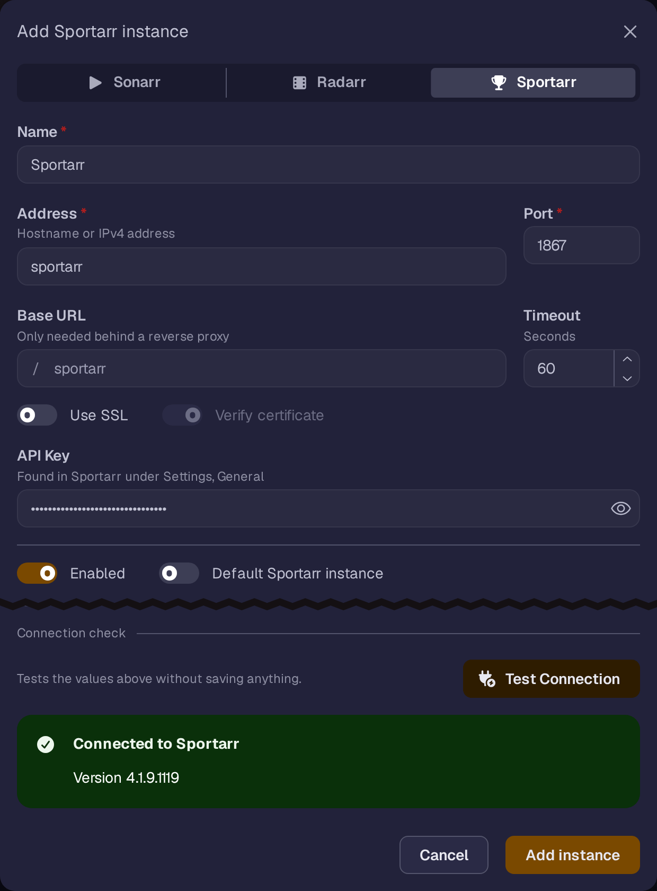

# Bazarr and Bazarr+

  

Bazarr manages subtitles for your sports library. There are two ways to connect it: [Bazarr+](https://github.com/LavX/bazarr), a Bazarr fork with native Sportarr support, or upstream Bazarr, where you add Sportarr as if it were Sonarr.

## Bazarr+

Bazarr+ has Sportarr as its own connection type next to Sonarr and Radarr. It talks to Sportarr through the native [Integration API](../development/integration-api.md) and event stream rather than the Sonarr compatibility layer. Your leagues get their own **Sports** entry in the menu, and each league's page lists its events. Events get the same subtitle tools as episodes: automatic and manual search, Wanted, History, upload, sync, and translation. You can connect more than one Sportarr.

!!! info "Availability"
    Native Sportarr support shipped in [Bazarr+ v2.7.0](https://github.com/LavX/bazarr/releases/tag/v2.7.0). The Docker image is `ghcr.io/lavx/bazarr`, and the [getting started guide](https://lavx.github.io/bazarr/guides/getting-started.html) covers installation.

1. In Bazarr+, go to **Settings > Connections > Sportarr**, turn on **Use Sportarr** and click **Save**

    

2. Add a Sportarr instance. For **Address**, use the container name (e.g. `sportarr`) if both apps are on the same Docker network, or your server IP otherwise. Set **Port** to `1867` and paste your Sportarr API key (**Settings > General > Security** in Sportarr). Leave **Base URL** empty unless Sportarr is behind a reverse proxy

    

3. If Sportarr and Bazarr+ see the same files at different paths, add a path mapping on the instance
4. Click **Test Connection**, then **Add instance** to save it

Bazarr+ syncs your leagues and events on a schedule and also follows Sportarr's event stream, so a new import is synced and indexed shortly after it lands. With **Search After Sync** on (the default), Bazarr+ then searches for its missing subtitles. Give each league a language profile from its page, or set a default profile for newly synced leagues on the instance.

## Upstream Bazarr

Bazarr releases do not have a Sportarr connection of their own yet, so add Sportarr exactly like you'd add Sonarr.

1. In Bazarr, go to **Settings > Sonarr** and enable it
2. Set the **Address** and **Port** to your Sportarr host (e.g. your server IP and `1867`)
3. Paste your Sportarr API key (**Settings > General** in Sportarr), then test and save

Bazarr reads your leagues and events and searches for subtitles automatically.

!!! tip
    Sports releases often lack embedded subtitles entirely, so the upgrade settings in either app ("search until a better subtitle is found") work well here.
