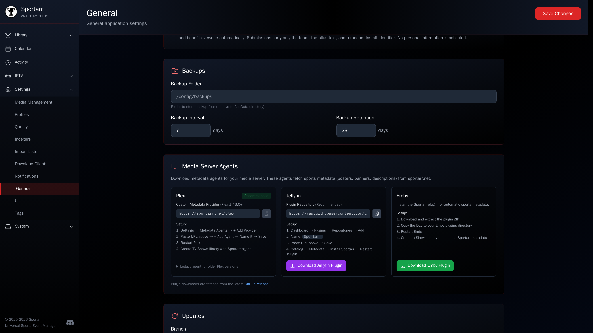

# Plex

  

Sportarr provides a metadata agent for Plex that fetches posters, banners, descriptions, and episode organization from sportarr.net.

Sportarr supports two methods for Plex.

## Custom metadata provider (recommended)

For **Plex 1.43.0+**, use the Custom Metadata Provider system. No plugin installation required.

1. Open **Plex Web** and go to **Settings > Metadata Agents**
2. Click **+ Add Provider**
3. Enter the URL: `https://sportarr.net/plex`
4. Click **+ Add Agent** and give it a name (e.g. "Sportarr")
5. **Restart Plex Media Server**
6. Create a **TV Shows** library, select your sports folder, and choose the **Sportarr** agent

Files the Sportarr app names carry the event's id (`sportarr-ev-2338110`). The provider reads it to match the show, the way Plex reads a tvdb id in a folder name, so a folder named anything still lands on the right league. Each file is then placed by its season and episode numbers, because that is how Plex places every episode, and Sportarr keeps those numbers current. See [File naming](../features/file-naming.md#the-sportarr-id-token).

## Legacy bundle agent

For older Plex versions, download the legacy bundle from the Sportarr UI (**Settings > General > Media Server Agents**) and copy it to your Plex Plug-ins directory.

!!! warning
    Plex has announced legacy agents will be deprecated in 2026. Prefer the custom metadata provider above.

See [agents/plex/README.md](https://github.com/Sportarr/Sportarr/blob/main/agents/plex/README.md) for detailed instructions and troubleshooting.
